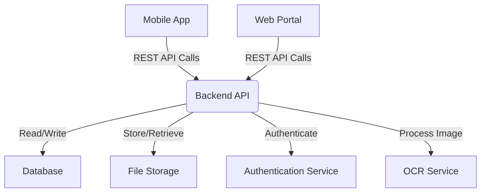
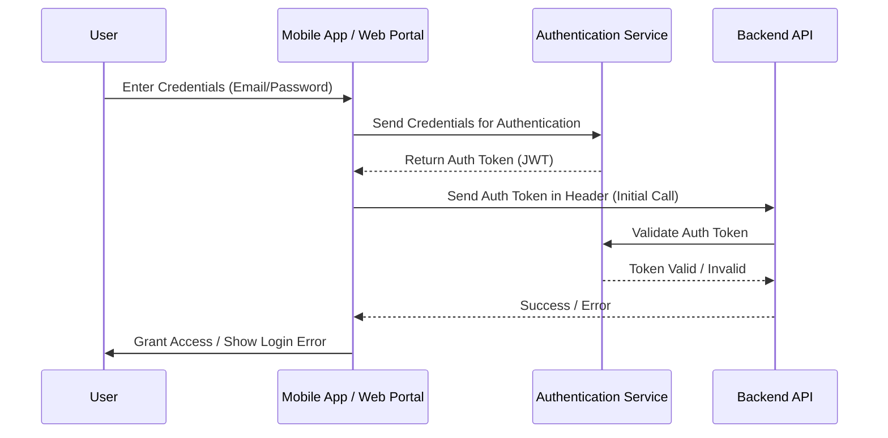
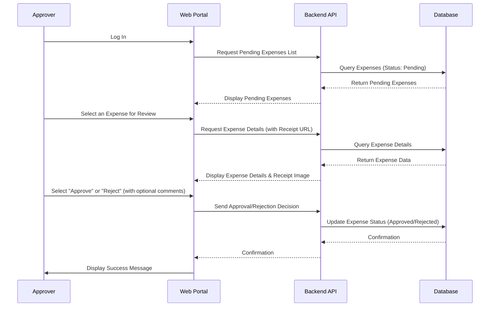
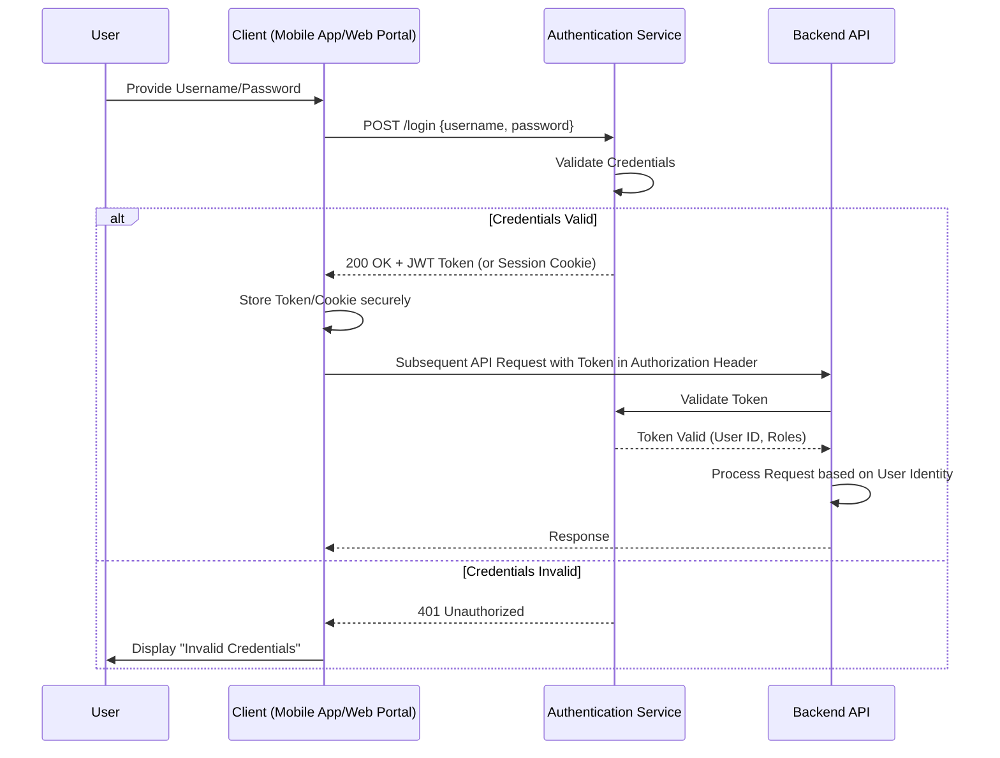

As a Solutions Architect, I've outlined an MVP plan for your expenses app, focusing on core functionality and deferring more complex AI/ML features for future iterations. This plan prioritizes rapid development and delivers immediate value by streamlining basic expense submission and approval.

Here is the flow documentation in markdown format:

```markdown
# Expenses App - Minimum Viable Product (MVP) Architectural Overview

**Version:** 1.0
**Date:** August 7, 2025

---

## 1. System Overview

The MVP for the expenses app focuses on enabling users to submit expenses, attach receipts (with basic OCR assistance), and facilitate a simple approval workflow. The system is designed with a clear separation of concerns, utilizing standard web and mobile application architectures.

**Key Components:**

*   **Mobile App (User Interface - UI):** Native iOS/Android application for expense submission, tracking, and viewing personal expense history.
*   **Web Portal (User Interface - UI):** Web-based application for approvers to review and manage pending expenses, and for finance/admin to view aggregated data.
*   **Backend API (Application Logic):** A RESTful API serving both mobile and web clients. It orchestrates business logic, interacts with the database, and integrates with external services.
*   **Database (Data Storage):** Stores all application data including user profiles, expense records, categories, and approval statuses. (e.g., PostgreSQL, MongoDB).
*   **File Storage (Receipts):** Stores uploaded receipt images. (e.g., AWS S3, Azure Blob Storage, or equivalent).
*   **Authentication Service:** Handles user registration, login, and session management. (Can be an external IdP like Auth0/Firebase or an internal service).
*   **OCR Service (Basic Receipt Processing):** An external service (e.g., Google Cloud Vision API, Azure Cognitive Services) used to extract text from receipt images, primarily for amount, date, and vendor.

**Component Interactions:**



---

## 2. User Workflows

This section outlines the primary user journeys within the MVP.

### 2.1 User Login

Users must authenticate to access the application functionalities.



### 2.2 Submit an Expense (Mobile App)

The core workflow for a user to create and submit an expense report.

```mermaid
graph TD
    A[Start: User Opens App] --> B{Select "New Expense"}
    B --> C{Take Photo / Upload Image?}
    C -- Yes (Photo) --> D[App Captures Image]
    D --> E[App Uploads Image to Backend]
    C -- No (Manual) --> F[App Displays Empty Form]

    E --> G[Backend Sends Image to OCR Service]
    G --> H[OCR Service Returns Extracted Text]
    H --> I[Backend Processes & Returns Pre-filled Data]
    I --> J[App Displays Pre-filled Form]

    F --> K[User Manually Fills Form]
    J --> K
    K --> L[User Reviews & Edits Details]
    L --> M{All Required Fields Filled?}
    M -- No --> L
    M -- Yes --> N[User Clicks "Submit"]
    N --> O[App Sends Expense Data to Backend]
    O --> P[Backend Creates Expense Record (Status: Pending)]
    P --> Q[End: Confirmation to User]
```

### 2.3 Approve/Reject an Expense (Web Portal)

The workflow for an approver to review and act on submitted expenses.



---

## 3. Data Flows

This section details how information moves between system components, focusing on the expense submission process.

### 3.1 Expense Submission Data Flow

This flow illustrates the journey of an expense claim from creation by the user to its persistence in the database.

```mermaid
graph TD
    A[User's Mobile Device] -->|1. Upload Image (Raw/Compressed)| B(Mobile App)
    B -->|2. HTTP POST /upload-receipt| C(Backend API)
    C -->|3. Store Image Temporarily| D[File Storage]
    C -->|4. Call OCR Service (Image Data)| E(OCR Service)
    E -->|5. Return Extracted Text (JSON)| C
    C -->|6. Respond with Pre-filled Data (JSON)| B
    B -->|7. Display Pre-filled Form| A
    A -->|8. User Reviews/Corrects Data| B
    B -->|9. HTTP POST /submit-expense (Final Data)| C
    C -->|10. Validate Data & Associate Image| F[Business Logic]
    F -->|11. Persist Expense Record| G[Database]
    G -->|12. Store Image Permanently| D
    D -->|13. Return Success Confirmation| C
    C -->|14. Return Success to App| B
    B -->|15. Display Confirmation| A
```

**Flow Steps Explained:**

1.  **User captures/selects image:** User takes a photo of the receipt or selects one from their gallery.
2.  **Mobile App uploads image:** The app sends the image (or a reference if already uploaded) to the Backend API.
3.  **Backend stores image temporarily:** The Backend API saves the raw image to a temporary location in File Storage.
4.  **Backend calls OCR Service:** The Backend API sends the image data to the configured OCR Service.
5.  **OCR Service returns extracted text:** The OCR Service processes the image and returns structured data (e.g., amount, date, vendor name, etc.) in JSON format.
6.  **Backend responds with pre-filled data:** The Backend API parses the OCR output, formats it, and sends this pre-filled expense data back to the Mobile App.
7.  **Mobile App displays pre-filled form:** The app populates the expense submission form fields with the received data.
8.  **User reviews/corrects data:** The user reviews the OCR-extracted data, makes any necessary corrections, and fills in other required fields (e.g., category, description).
9.  **Mobile App submits final expense data:** The app sends the complete expense form data to the Backend API.
10. **Backend validates data & associates image:** The Backend API performs validation checks and links the expense record to the permanently stored receipt image.
11. **Backend persists expense record:** The complete expense record (including all details and a reference to the receipt) is saved in the Database.
12. **Backend stores image permanently (if not already):** The receipt image is moved from a temporary location to its permanent storage location in File Storage, linked to the expense record.
13. **Database/File Storage confirms persistence:** Confirmation is sent back to the Backend API.
14. **Backend returns success to app:** The Backend API sends a success response to the Mobile App.
15. **Mobile App displays confirmation:** The app shows a confirmation message to the user that the expense has been submitted.

---

## 4. Error Handling

Robust error handling is critical for a good user experience and system reliability.

*   **User Interface (Mobile App / Web Portal):**
    *   **Input Validation:** Implement client-side validation for mandatory fields and data formats. Provide immediate feedback to the user (e.g., "Amount is required").
    *   **Network Errors:** Display user-friendly messages for network connectivity issues. Implement retry mechanisms for idempotent operations (e.g., "Connection lost, please try again").
    *   **API Errors:** Translate backend error messages into clear, actionable notifications for the user (e.g., "Submission failed: Invalid category selected").
    *   **OCR Failures:** If OCR fails to extract meaningful data or returns low confidence, prompt the user for full manual input or highlight fields that need attention.

*   **Backend API:**
    *   **API Validation:** Implement comprehensive server-side validation for all incoming requests. Return appropriate HTTP status codes (e.g., 400 Bad Request for invalid input).
    *   **External Service Failures (OCR, Auth, File Storage):**
        *   Implement circuit breakers and timeouts to prevent cascading failures.
        *   Log errors with sufficient detail (request payload, error message, stack trace).
        *   For OCR, if the service is unavailable or consistently fails, fall back to requiring manual user input for those fields.
        *   For critical failures (e.g., Database unavailable), return 500 Internal Server Error and notify monitoring systems.
    *   **Database Errors:** Handle database connection issues, query failures, and constraint violations gracefully. Implement retry logic for transient errors.
    *   **Logging:** Implement structured logging for all errors, warnings, and key events. Use a centralized logging system for easier debugging and monitoring.
    *   **Idempotency:** Design API endpoints (especially for creation/update) to be idempotent where possible, to handle client retries safely.

---

## 5. Security Flows

Security is paramount for an application handling financial data.

### 5.1 Authentication (User Login)

Ensures only legitimate users can access the system.



**Key Steps:**

1.  **User Credentials:** User enters their username and password into the client application.
2.  **Authentication Request:** The client sends these credentials to the Authentication Service.
3.  **Credential Validation:** The Authentication Service verifies the credentials against its user store.
4.  **Token Issuance:** If valid, the Authentication Service issues a JSON Web Token (JWT) or sets a secure session cookie. This token contains user identity and roles.
5.  **Token Storage:** The client securely stores the token (e.g., in `Keychain` for iOS, `Keystore` for Android, `HttpOnly` cookies for web).
6.  **Authenticated Requests:** For all subsequent API calls, the client includes the JWT in the `Authorization: Bearer <token>` header (or relies on the session cookie).
7.  **Token Validation (Backend):** The Backend API intercepts incoming requests and validates the provided JWT with the Authentication Service or by verifying its signature locally (if stateless JWTs are used).
8.  **Request Processing:** If the token is valid, the Backend API extracts the user's identity and roles and proceeds to process the request.

### 5.2 Authorization (Role-Based Access Control - RBAC)

Ensures authenticated users can only access resources and perform actions permitted by their assigned roles.

```mermaid
graph TD
    A[Authenticated User Request] --> B{Backend API}
    B --> C{Extract User Roles from Token}
    C --> D{Check Access Policy (Role vs. Resource/Action)}
    D -- Allowed --> E[Execute Business Logic]
    E --> F[Return Data/Success]
    D -- Denied --> G[Return 403 Forbidden]
```

**Key Roles (MVP):**

*   **Submitter:** Can create, view, and edit their *own* expenses (when in Draft/Pending status). Can submit expenses for approval.
*   **Approver:** Can view *all* expenses submitted to them, approve, or reject expenses. Cannot create new expenses for others.
*   **Admin/Finance:** Can view *all* expenses across the organization. Can export data. (Minimal functionality in MVP beyond viewing/exporting).

**Authorization Enforcement:**

*   The Backend API is responsible for enforcing authorization.
*   Upon receiving an authenticated request, the API extracts the user's roles from the validated authentication token.
*   Before performing any operation, the API checks if the user's roles have the necessary permissions for the requested resource and action (e.g., "Can a 'Submitter' update an expense that is not theirs?").
*   If authorized, the request proceeds; otherwise, a `403 Forbidden` response is returned.

**Data Segregation:**

*   Ensure that users can only view or modify data they are authorized for (e.g., a "Submitter" can only see their own expenses, unless they are also an "Approver" for a specific set of users).
*   Database queries must include filters based on the authenticated user's ID and role.

---
This MVP plan provides a solid foundation for your expenses app, focusing on essential features while leaving room for the advanced AI/ML capabilities you envisioned in future iterations.
